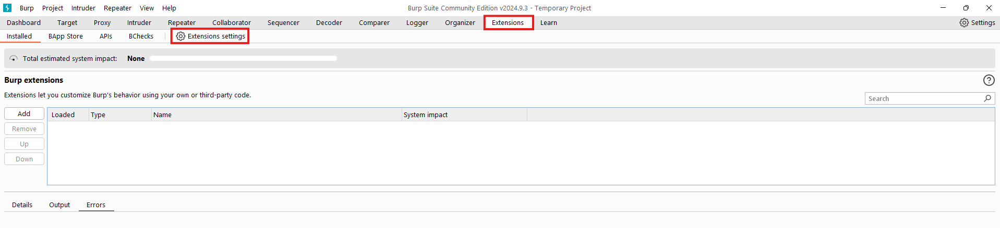
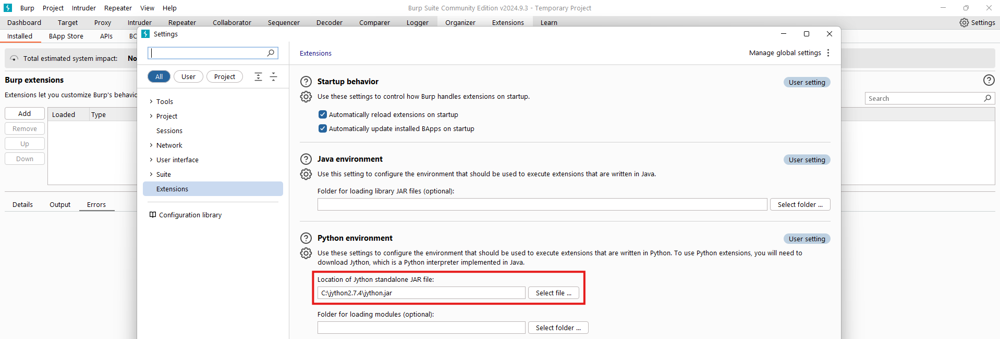
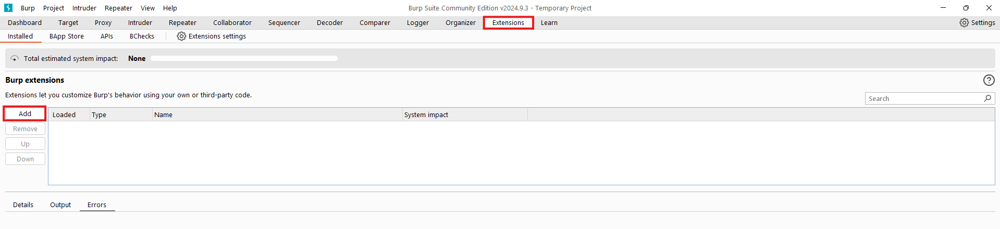
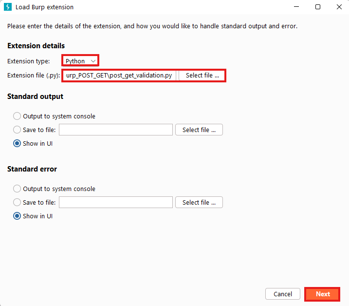
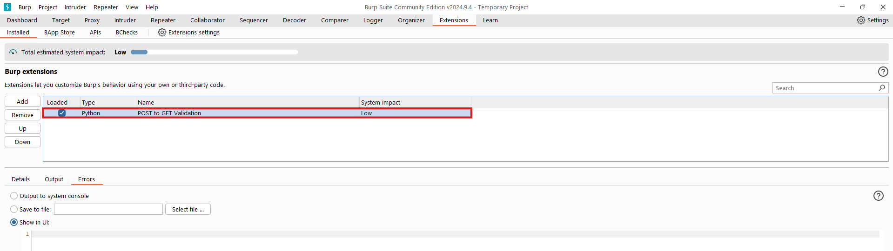
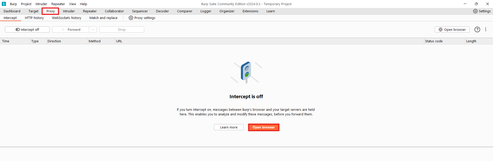
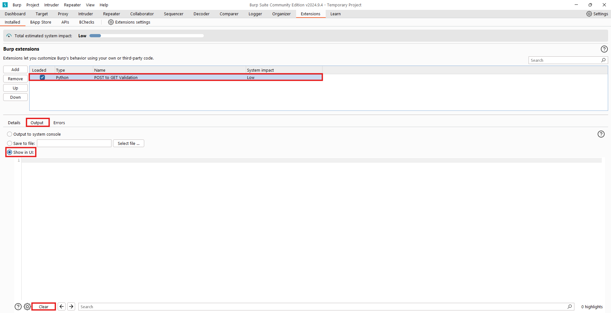
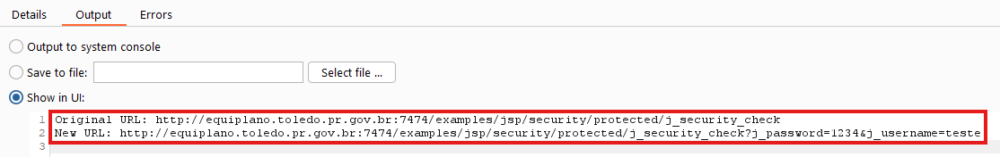

# Burp POST to GET validation
This is a extension created for Burp to validate if a POST request that contains a form (e.g. login) successfully answer to a GET request with querystring parameters.

## Table of contents

* [Installation](#installation)
* [Usage](#usage)

## Installation
### Installing Java
To execute JAR files, you need to have Java installed in your machine:

_If you already have Java on your machine, you can skip to the next step._
  1. Download [Java installer](https://www.java.com/download/ie_manual.jsp)
  2. Run the .exe file and wait for the installation to be completed.

### Installing Jython
To run the extension, Burp needs Jython to be installed in the machine where it runs since the code was made in Python:

_If you already have Jython configured in your Burp, you can skip to the next step._
  1. Download [Jython](https://www.jython.org/download) JAR (This test were executed using the version 2.7.4).
  2. Go to `Extensions` > `Extensions settings`.

  
  
  3. In `Python Environment` > `Location of Jython standalone JAR file` search and select the **Jython JAR file**.
  
  
  
  4. Close the `Settings` window.

### Configuring the Extension
  1. Go to `Extensions` > `Add`.

  

  2. Change the `Extension type` to `Python`.
  3. In `Extension file`, search and select the `pii_cpf_scanner.py` file.
  4. Click in `Next`
 
  

  5. A sucessfull message will appear and then you can close the window.
  6. Your installed extensions will be displayed in `Burp extensions`.
 
  

## Usage
After installing the extension, follow this steps to check the output data of your new extension:
  1. Go to `Proxy` > `Open Browser` to open a configured browser to send the traffic to Burp.

  

  2. Go to `Extensions`.
  3. Click on `PII CPF Scanner` extension.
  4. Click on `Output` and let the `Show in UI` option enabled.
  
  _For reference, you can clear the Output anytime by pressing the Clear button_

  

  5. Access a site which has a CPF data in the `Response Body` in the `Burp browser` (For reference, [this](http://equiplano.toledo.pr.gov.br:7474/examples/jsp/security/protected/index.jsp) was the site used in this test).
  6. When you try to login in the Web Application, you will be able to see both the `Original URL` and `New URL` that was modified and sent through GET in `Output`.

  

  > The Extension also creates an Issue on Burp Scanner, but since it only works on Burp Pro, I won't be able to demonstrate it here.
